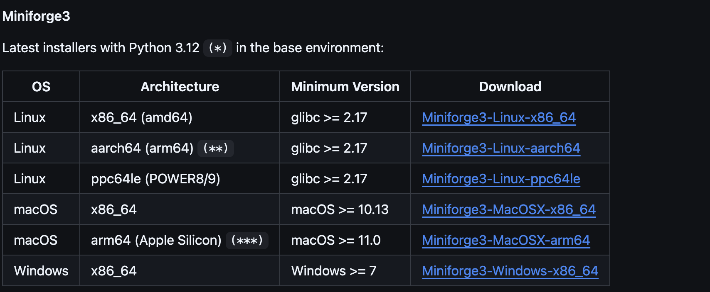
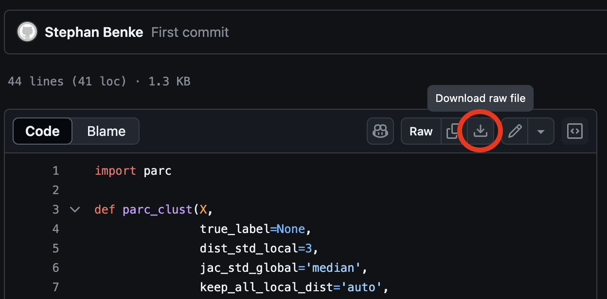

# MARMOT

Multifaceted R Pipeline for Analysing Spectral Flow Cytometry Data 

<div align="center">
  
</div>

## Installation Instructions

### At A Glance

*Basic setup*

* Install R (>= version 4.3)
* Install Bioconductor (>= version 3.18)
* Install the required R packages

*Advanced setup*

* Install Rphenograph/FastPG
* Install conda (even better, mamba)
* Download PARC/PaCMAP python scripts from Stephan Benke-Bruderer
* Modify the FC pipeline script to include your mamba installation location and location of PARC/PaCMAP scripts 
* Ensure you're running x86 R and mamba if using M-series Mac to ensure compatibility with everything

### Full Installation Guide

#### Part 1: Basic Setup

Follow these instructions to get the main features running, which will enable you to use t-SNE and UMAP for plotting, and FlowSOM for clustering.

Based on R 4.4.1; Bioconductor 3.19.

Assuming you have R and RStudio/Positron installed. 

**NOTE**: If you're using an M-series Mac, it is *highly* recommend downloading the x86_64 version of R to ensure compatibility with all the packages. It is **required** for FastPG, PARC, and PaCMAP. 

```{r eval = F}
# In R
install.packages("BiocManager")
BiocManager::install(version = "3.19")
```

```{r eval = F}
# In R
packagesToInstall <- c(
  "flowCore", "FlowSOM", "tidyverse", "CATALYST", "readxl", "cowplot", 
  "diffcyt", "ggpubr", "flowSpecs", "ggprism", "gridExtra", "rstatix", "plotly",
  "slingshot", "grDevices", "RColorBrewer", "reshape2", "grid", 
  "ComplexHeatmap", "circlize", "clustree", "kableExtra", "DT", "flowAI", 
  "parallel", "qs", "ggrepel", "gtools", "reticulate", "ggbeeswarm", "futures"
)
BiocManager::install(packagesToInstall, force = TRUE)
```

Installing these on a new system can take considerable time, especially on Linux-based systems (potentially over 30 minutes). For a fresh Linux installation (*e.g.*, a cluster node), you may need to install several additional libraries, which will require `sudo` access.

#### Part 1: Rphenograph

We strongly suggest taking a moment to also install Rphenograph.

[RPhenograph](https://github.com/JinmiaoChenLab/Rphenograph) is not available on Bioconductor and as such needs to be installed manually. 

It may not compile on the ARM version of R on M-series Macs. Again, it is advised to use an x86 installation where possible. 

```{r eval = F}
# In R
# Install devtools if required
install.packages("devtools")
devtools::install_github("JinmiaoChenLab/Rphenograph")
```

#### Test the Installation

Once you have installed the Bioconductor packages and RPhenograph, it is important to test that they installed and load correctly. 

If all packages have installed correctly, you should be able to run the following code with no errors, and all should return TRUE:

```{r eval = F}
# In R
lapply(
  c(packagesToInstall, "Rphenograph"), 
  require, 
  character.only = TRUE, 
  quietly = TRUE
)
```

If there are any issues, please manually check which package has failed to install. It probably has dependencies that did not install due to missing libraries. 

\textcolor{red}{Once these have been installed, the pipeline will work with the following cell-clustering and dimension reduction methods: Rphenograph, FlowSOM, UMAP, and tSNE.}

If you wish to use alternative methods, including FastPG, PARC, and PaCMAP, follow the instructions below. 

****** 

****** 

### Optional Steps

The following steps are optional and are only required for FastPG, PARC, and PaCMAP.

#### FastPG Support 

FastPG will need to be installed separately, and can be found [here](https://github.com/sararselitsky/FastPG).

Again, this will not work on M-series Macs using native R (*i.e.*, the arm64 version), you will need to install the x86 version of R.

```{r eval = F}
# In R
BiocManager::install("sararselitsky/FastPG")
```

#### PARC and PaCMAP Support 

##### Step 1: Install Conda/Mamba 

First you will need to install `conda`, or better still, `mamba`. This is a package/environment manager for python. 

To do this, first go to https://github.com/conda-forge/miniforge and download the appropriate installation script for your system (Figure 1).



**NOTE**: If you're using an M-series Mac, you will *have* to install the x86_64 version of mamba, same as R.

Then, execute the script and follow the instructions, *e.g.*:

```{bash eval = F}
# In the terminal
# Assuming you have downloaded the script to the downloads folder 
~/Downloads/Miniforge3-MacOSX-x86_64.sh
```

##### Step 2: Install PARC/PaCMAP

The scripts used to run PARC and PaCMAP were written by Dr. Stephan Benke-Bruderer, and are available at https://github.com/stbenke/p4r (Figure 2).

The following instructions, adapted from https://github.com/stbenke/p4r, assume you have mamba up and running.

```{bash, eval = F}
# In the terminal
# updated to newest mamba: 
mamba update mamba

# created env very explicitly via:
mamba create -n p4r python=3.9 numpy=1.22.3  

# activate the new environment
mamba activate p4r

# packages for pacmap:  
mamba install -c anamamba scikit-learn  
mamba install -c mamba-forge python-annoy  
mamba install numba  
pip install pacmap  

# packages for parc:  
mamba install -c mamba-forge python-igraph
mamba install -c mamba-forge leidenalg
mamba install -c mamba-forge hnswlib
pip install parc
```

Then you will need to download the python scripts for PARC and PaCMAP to a folder, and get the full file path of where you've saved the two python scripts. *E.g.*, download them to a folder such as `~/Desktop/FC_Pipeline/parc_pacmap/`. Do not change the name of the individual scripts themselves, *i.e.*, make sure they are named `f_parc.py` and `f_pacmap.py`.

* Link to the PARC Script: https://github.com/stbenke/p4r/blob/master/f_parc.py

* Link to the PaCMAP Script: https://github.com/stbenke/p4r/blob/master/f_pacmap.py



Once you have installed mamba, PARC, and PaCMAP, and have downloaded the two scripts, you will need to modify the main FC pipeline script to tell it where mamba is installed and where the two scripts are placed. This is done on lines 26 and 28 of the main FC pipeline script (*i.e.*, the variables `condaDir` and `parcScriptDir`.)

An ideal directory would look like the following:

* The pipeline script
* A folder containing the f_parc.py and f_pacmap.py scripts 
* A folder containing the FCS files and the Excel metadata file