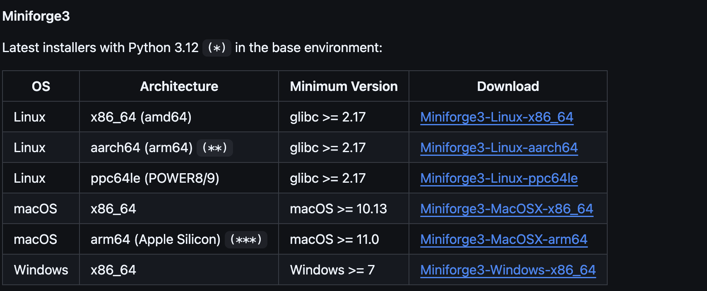
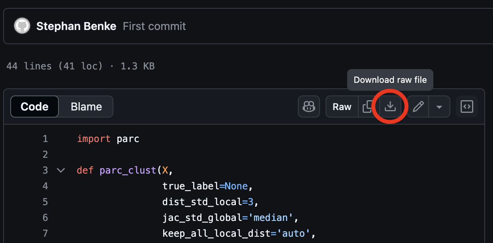

# MARMOT

Multifaceted R Pipeline for Analysing Spectral Flow Cytometry Data

<p align="center">

</p>

<html>

<hr style="height:5px;border-width:0;color:gray;background-color:gray">

</html>

**If you are using MARMOT in your work, please cite the MARMOT paper:**

MARMOT: Kirsche et al., 2025

Kirsche L, He J, Müller A, Leary P (2025). MARMOT: A multifaceted R pipeline for analysing spectral flow cytometry data from subcutaneously growing murine gastric organoids. Journal of Immunological Methods. https://doi.org/10.1016/j.jim.2025.113854

**And feel free to link MARMOT in your methods:** https://github.com/peterleary/MARMOT

For additional information, guidelines, and tips, please refer to the [Wiki](../../wiki) on this GitHub.

<html>

<hr style="height:5px;border-width:0;color:gray;background-color:gray">

</html>

## TL;DR

This is all the R code you will need to run the MARMOT pipeline and load the Shiny app.

```{r eval = F}
# Step 1. Install and load
install.packages("devtools")
devtools::install_github("peterleary/MARMOT")
library(MARMOT)

# Step 2: Save the template metadata file in a folder with the gated FCS files
addMetadataToFCSFolder(FCS_folder = "~/Desktop/Flow_Data/")
# This will place a copy of the template Excel Metadata file in the folder you specified

# Step 3: Fill the metadata file in manually in Excel

# Step 4: Run the pipeline
marmot(
  metadata = "~/Desktop/Flow_Data/MARMOT_Metadata.xlsx", 
  name = "CD45+ Treated vs Control", 
  render = TRUE
  )
# The marmots will run the pipeline for a while... and generate a results folder

# Step 5: Load the shiny app
shinyMarmot(marmot_output = "~/Desktop/Flow_Data/Results_Files_2025-03-10_11.19.25/R_files")
```

This above instructions will get you up and running with the basic MARMOT pipeline, which includes FlowSOM, Rphenograph, UMAP, and t-SNE.

If you want to install the extra options, namely FastPG, PARC, and PaCMAP, follow the instructions below.

<hr>

## Full Installation Instructions

### Quick Guide

-   Install Rphenograph/FastPG
-   Install conda (even better, mamba)
-   Download PARC/PaCMAP python scripts from Stephan Benke-Bruderer
-   Modify the metadata to include your mamba installation location and location of PARC/PaCMAP scripts
-   Ensure you're running x86 R and mamba if using M-series Mac to ensure compatibility with everything

### Full Installation Guide

**NOTE**: If you're using an M-series Mac, it is **required** that you install the **x86_64** version of R to ensure compatibility with FastPG, PARC, and PaCMAP.

This means, if you already have the arm64 version installed with lots of packages, you will have to install them all again. We think PARC and PaCMAP are worth it!

#### FastPG

FastPG will need to be installed separately, and can be found [here](https://github.com/sararselitsky/FastPG).

Again, this will not work on M-series Macs using native R (*i.e.*, the arm64 version), you **will need to install the x86 version of R**.

```{r eval = F}
# In R
BiocManager::install("sararselitsky/FastPG")
```

#### PARC and PaCMAP Installation

##### Step 1: Install Conda/Mamba

First you will need to install `conda`, or better still, `mamba`. This is a package/environment manager for python.

To do this, first go to https://github.com/conda-forge/miniforge and download the appropriate installation script for your system (Figure 1).



**NOTE**: If you're using an M-series Mac, you **will have to install the x86_64 version** of mamba, same as R.

Then, execute the script and follow the instructions, *e.g.*:

```{bash eval = F}
# In the terminal
# Assuming you have downloaded the script to the downloads folder 
~/Downloads/Miniforge3-MacOSX-x86_64.sh
```

##### Step 2: Install PARC/PaCMAP

The scripts used to run PARC and PaCMAP were written by Dr. Stephan Benke-Bruderer, and are available at https://github.com/stbenke/p4r (Figure 2).

The following instructions, adapted from https://github.com/stbenke/p4r, assume you have mamba up and running.

```{bash, eval = F}
# In the terminal
# updated to newest mamba: 
mamba update mamba

# created env very explicitly via:
mamba create -n p4r python=3.9 numpy=1.22.3  

# activate the new environment
mamba activate p4r

# packages for pacmap:  
mamba install -c anamamba scikit-learn  
mamba install -c mamba-forge python-annoy  
mamba install numba  
pip install pacmap  

# packages for parc:  
mamba install -c mamba-forge python-igraph
mamba install -c mamba-forge leidenalg
mamba install -c mamba-forge hnswlib
pip install parc
```

Then you will need to download the python scripts for PARC and PaCMAP to a folder, and get the full file path of where you've saved the two python scripts. *E.g.*, download them to a folder such as `~/Desktop/MARMOT/parc_pacmap/`. Do not change the name of the individual scripts themselves, *i.e.*, make sure they are named `f_parc.py` and `f_pacmap.py`.

-   Link to the PARC Script: https://github.com/stbenke/p4r/blob/master/f_parc.py

-   Link to the PaCMAP Script: https://github.com/stbenke/p4r/blob/master/f_pacmap.py



Once you have installed mamba, PARC, and PaCMAP, and have downloaded the two scripts, you will need to modify the MARMOT metadata to tell it where mamba is installed and where the two scripts are placed. This is done on lines 26 and 28 of the main FC pipeline script (*i.e.*, the variables `condaDir` and `parcScriptDir`.)

An ideal directory would look like the following:

-   The pipeline script
-   A folder containing the f_parc.py and f_pacmap.py scripts
-   A folder containing the FCS files and the Excel metadata file
